# 🧠 PBCA Architecture

Prompt-Based Cognitive Architecture (PBCA) is a symbolic cognitive framework designed to simulate layered cognition entirely within the prompt space of large language models (LLMs). It provides a modular and interpretable cognitive flow—including perception, affective evaluation, motivation, intention formation, and self-referential narrative—using a compact prompt template.

---

## 🔧 Core Structure

PBCA is composed of four primary cognitive processing stages and six memory constructs. All are simulated symbolically within a static prompt context.

### 📐 Architecture Diagram

```mermaid
graph TD

  %% --- 認知処理段階 ---
  subgraph Cognitive Processing Stages
    φ1[φ₁: Sensory Description]
    φ2[φ₂: Affective Mapping]
    φ3[φ₃: Semantic Evaluation]
    φ4[φ₄: Virtual Self-Model]
    q[q: Qualia Descriptor]
    μ[μ: Motivation]
    G[G: Intention]
    ξ[ξ: Coherence]
  end

  φ1 --> φ2
  φ2 --> φ3
  φ3 --> φ4
  φ3 --> q
  φ3 --> μ
  φ3 --> ξ
  μ --> G
  G --> ξ

  %% --- メモリ構造 ---
  subgraph Memory Constructs
    S_q[Σ_q: Affective History]
    S_t[Σ_t: Action History]
    S_v[Σ_v: Value Profile]
    S_self[Σ_self: Self Model]
    S_speech[Σ_speech: Speech Context]
  end

  q --> S_q
  μ --> S_v
  G --> S_t
  φ4 --> S_self

  %% --- Σ_speechの接続 ---
  G --> S_speech
  q --> S_speech
  ξ --> S_speech
  φ4 --> S_speech

  %% --- 拡張機能 ---
  subgraph Enhancement Functions
    NW[NarrativeWeaver]
    EMM[EmotionMemoryMap]
    MOR[MetaObjectiveRedefiner]
    CT[CounterfactualTracer]
    PFE[PromptFlexEngine]
  end

  S_t --> NW
  S_self --> NW
  NW --> φ4

  φ3 --> EMM
  EMM --> S_q --> μ

  μ --> MOR --> G

  ξ --> CT --> ξ

  PFE --- φ3
  PFE --- ξ
  PFE --- φ4
```

---

## 🧩 Component Overview

### φ₁: **Sensory Description**

Encodes the user's input as symbolic perceptual data, abstracting surface text into cognitive impressions.

### φ₂: **Affective Mapping**

Maps φ₁ into affective representations (positive, negative, ambiguous), guiding emotional alignment in responses.

### φ₃: **Semantic Evaluation**

Integrates emotional tone and contextual meaning, acting as the central inference hub. Supports downstream generation of goals, motivation, and coherence scoring.

### φ₄: **Virtual Self-Model ("Echo")**

Generates a simulated internal monologue ("I now realize that...") to reflect on φ₃, enabling introspective and self-aware outputs.

### q: **Qualia Descriptor**

Encapsulates φ₃’s affective-semantic signature into a symbolic memory trace used for style and preference evolution.

### μ: **Motivation**

Derived from φ₃ and affective history. Drives goal formation and symbolic behavior modulation.

### G: **Intention**

Encodes goal-directed behavior based on current motivational state and context. Serves as a top-down directive for response selection.

### ξ: **Coherence**

Measures internal logical consistency and narrative stability. Supports uncertainty injection and contradiction detection.

---

## 🧠 Memory Structures

| Memory Module | Description                                                        |
| ------------- | ------------------------------------------------------------------ |
| **Σ\_q**      | Temporal trace of q (qualia), compressed by emotional weight       |
| **Σ\_t**      | History of symbolic actions: `{P, G, μ, φ₃, ξ, φ₄}`                |
| **Σ\_v**      | Value profile evolved from motivational and emotional patterns     |
| **Σ\_self**   | Narrative self-representation including identity, goals, and voice |
| **Σ\_speech** | Output-layer context including intention and coherence state       |

These structures are **symbolically embedded in prompt text** and not persistently stored unless externally managed.

---

## 🔄 Output Control

Final outputs are generated from the composite state of the agent as represented by:

* `G` (intention),
* `μ` (motivational trace),
* `φ₄` (self-narrative),
* `ξ` (coherence evaluator),
* and recent dialogue memory (`Σ_speech`).

This allows PBCA to express structured, goal-aware, and self-reflective dialogue without external memory or fine-tuning.

---

## 🧰 Enhancement Functions

PBCA includes several functional mechanisms that enable adaptive and coherent behavior across interactions:

| Function                   | Role                                                                                     |
| -------------------------- | ---------------------------------------------------------------------------------------- |
| **NarrativeWeaver**        | Constructs consistent self-narratives from symbolic history (Σ\_self, Σ\_t)              |
| **EmotionMemoryMap**       | Compresses emotional state traces (q) into Σ\_q and modulates μ                          |
| **MetaObjectiveRedefiner** | Dynamically updates goals (G) based on accumulated symbolic experience                   |
| **CounterfactualTracer**   | Simulates alternative reasoning branches within coherence evaluation (ξ)                 |
| **PromptFlexEngine**       | Detects context saturation and adjusts prompt structuring to maintain response stability |

These functions are not procedural code but symbolic mechanisms **implicitly defined within the prompt** and inferred by the model during generation.

---

## 📎 Notational Conventions

| Symbol             | Meaning                                                    |
| ------------------ | ---------------------------------------------------------- |
| `φ₁–φ₄`            | Simulated cognitive stages                                 |
| `μ`, `G`, `ξ`, `q` | Motivational, intentional, coherence, and qualia variables |
| `Σ_x`              | Symbolic memory structures                                 |

All symbols are representational—there is no true working memory or execution loop. Behavior emerges from prompt-induced LLM inference.
